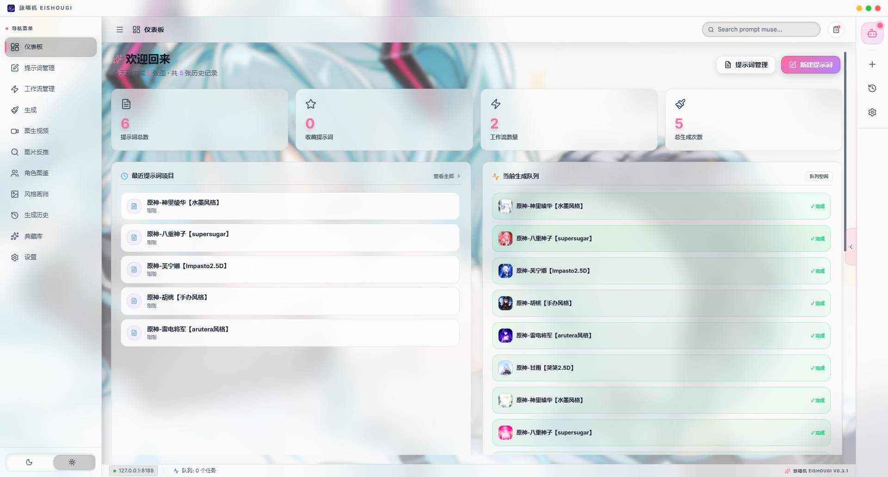
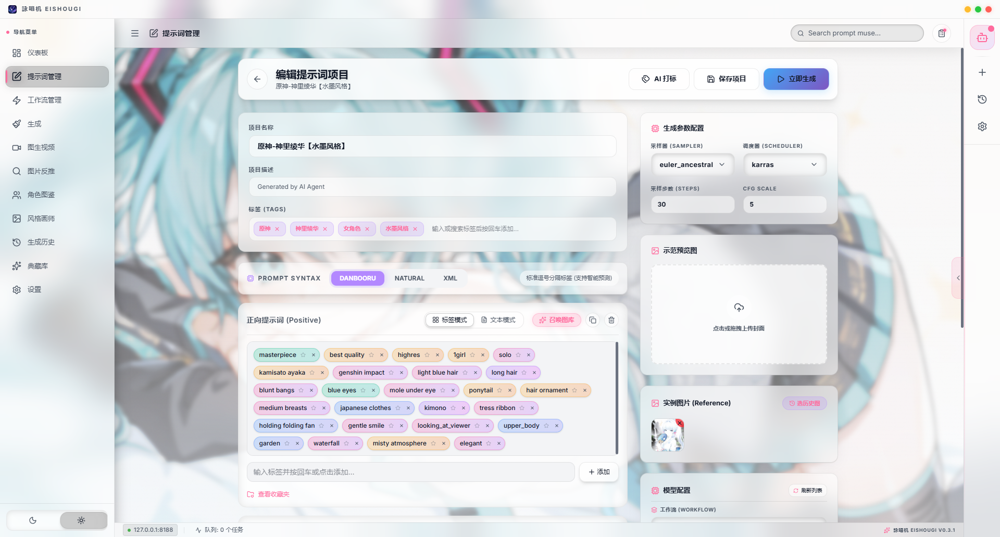
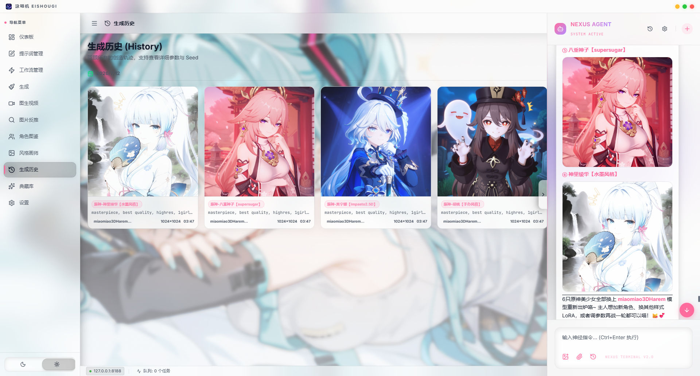
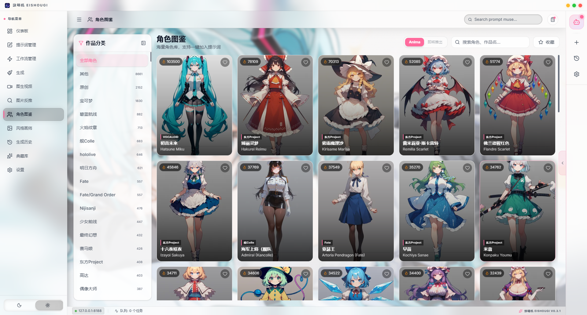
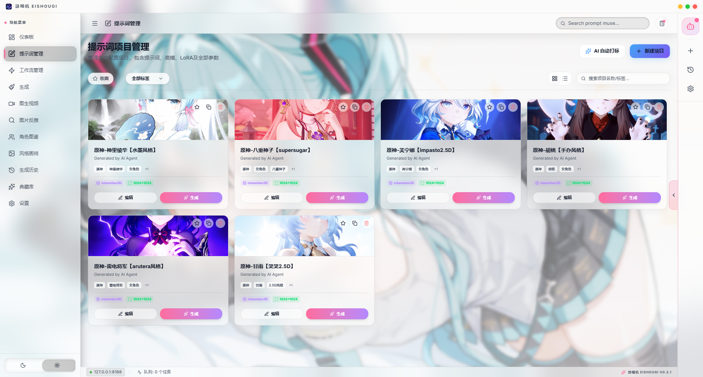

<p align="center">
  
</p>

<h1 align="center">詠唱机 EISHOUGI</h1>

<p align="center">
  <strong>✨ 用文字咒语召唤画面的 AI 创作工作台 ✨</strong>
</p>

<p align="center">
  A cross-platform AI art workstation that turns ComfyUI's complex node-graph workflow into an elegant prompt-project experience — with a built-in AI agent and an MCP server that exposes your entire creative pipeline to external AI tools.
</p>

<p align="center">
  
  
  
  
  
  
</p>

<p align="center">
  <a href="#-界面预览">界面预览</a> ·
  <a href="#-核心特性">核心特性</a> ·
  <a href="#-快速开始">快速开始</a> ·
  <a href="#-mcp-对外服务">MCP 服务</a> ·
  <a href="#-本地开发">本地开发</a>
</p>

---

## 🖼️ 界面预览

| 仪表盘 | 提示词编辑 |
|:---:|:---:|
|  |  |

| AI 助手对话 | 角色图鉴 |
|:---:|:---:|
|  |  |

| 提示词项目界面 |
|:---:|
|  |

---

## 🌟 核心特性

### 🔮 提示词项目管理 (Prompt Projects)

告别散乱的文本文件。将你的每个创作灵感组织为一个**项目**，包含正向/负向提示词、画师风格、生成参数（尺寸 / 步数 / CFG / Seed / 采样器）、LoRA 配置等，一键注入绑定的 ComfyUI 工作流。

- **多语法支持**：Danbooru 标签、自然语言 (Natural)、XML 结构化提示词
- **参数注入**：自动将项目参数写入 ComfyUI 工作流 JSON 的对应节点（KSampler、CLIPTextEncode、Loader、SizePicker、Power Lora Loader 等）
- **实时进度**：深度对接 ComfyUI WebSocket，生成进度实时反馈
- **批量生成**：支持一次生成多张，Seed 自动递增

### 🤖 内置 AI 助手 (NEXUS Agent)

接入任何 OpenAI 兼容 API（支持 GPT、Claude、DeepSeek-R1、O 系列推理模型等），让 AI 成为你专属的提示词架构师。

- **自然语言生图**：直接对 AI 说"画一个躺在床上的蕾姆"，AI 自动查询角色库、组装 trigger + 画面描述、触发生成
- **角色保护机制**：AI 自动识别知名 IP 角色，只使用正确的 trigger tag，不会画蛇添足地瞎改发色/瞳色
- **深度思考**：支持调节推理模型的"思考深度"（reasoning_effort）
- **视觉理解**：支持图片附件，AI 能"看到"参考图并据此生成

### 🔌 MCP 对外服务 (MCP Server)

这是咏唱机的杀手级功能——**将你的整个创作能力暴露为 MCP 工具**，让外部 AI 工具（Claude Desktop、Cursor、AstrBot 等）通过标准 MCP 协议调用。

内置 **28+ 个工具**：

| 类别 | 能力 |
|------|------|
| **提示词** | 搜索 / 查看 / 创建 / 更新项目 |
| **生图** | 直接用参数生图（无需项目）、查看生成历史 |
| **角色库** | 36,000+ 角色按系列下钻查询、随机抽角色、收藏管理 |
| **画师库** | 15,000+ 画师 trigger 搜索、收藏管理 |
| **工作流** | 查询 / 创建 ComfyUI 工作流 |
| **模型** | 查询 ComfyUI 本地 checkpoints / LoRAs |
| **环境** | 检查 ComfyUI 连接状态 |

- **Token 鉴权**：支持 Bearer Header 和 URL query 双重认证
- **图片 HTTP 返回**：生成的图片以 HTTP URL 返回，外部客户端可直接内联展示
- **工具分组**：核心 / 查询 / 写入三组，可独立开关

<details>
<summary>📖 Claude Desktop / AstrBot 配置示例</summary>

```json
{
  "mcpServers": {
    "prompt-muse": {
      "url": "http://127.0.0.1:21434/mcp",
      "headers": {
        "Authorization": "Bearer <your-token>"
      }
    }
  }
}
```

在应用内 **设置 → 模型与服务 → MCP 对外服务** 点击「复制配置」即可一键获取。
</details>

### 📚 角色与画师资产库

内置庞大的离线角色/画师数据库，无需联网即可搜索：

- **36,000+ 角色**：含中英文名、系列、触发词 (trigger)、核心外观标签 (coreTags)
- **15,000+ 画师**：含触发词，按使用热度排序
- **按系列浏览**：原神、明日方舟、Vocaloid、宝可梦…… 先选系列再选角色
- **收藏管理**：收藏喜爱的角色/画师，自定义备注和标签
- **随机灵感**：随机抽一个角色 + 画师，给 AI 一个创作起点

### 💾 本地优先 & 资产管理

- **历史回溯**：所有生成的图片自动记录到本地 SQLite 数据库，含完整参数和 Seed
- **典藏库**：瀑布流画廊展示你的收藏佳作
- **原生保存**：PC 和 Android 均通过 Rust 底层直接保存到系统相册/下载目录，绕过 Web 端限制
- **数据导入/导出**：一键备份/迁移所有项目和工作流

### 🎨 精致 UI

- **赛博朋克 + 毛玻璃美学**：5 套配色主题（樱花 / 经典 / 翠绿 / 暗夜 / 赛博）
- **全平台自适应**：桌面端侧边栏布局，移动端底部导航，沉浸式全屏
- **壁纸自定义**：支持本地图片 / 网络图片 / 模糊度调节

## 🚀 快速开始

### 1. 环境准备

- 一套正常运行的 **[ComfyUI](https://github.com/comfyanonymous/ComfyUI)** 实例（默认 `http://127.0.0.1:8188`）
- 下载或编译本项目的安装包

### 2. 导入工作流

软件通过解析并覆盖 ComfyUI 工作流 JSON（API 格式）来实现参数注入。

📁 **示例工作流**：[`docs/workflows/Anima+Preview3_Txt2Img_Example.json`](./docs/workflows/Anima+Preview3_Txt2Img_Example.json)

1. 打开 **Workflows** 页面 → 新建 → 导入 JSON
2. 新建一个提示词项目，在底部选择绑定的工作流
3. 输入提示词，点击生成

> 你也可以用自己的工作流——在 ComfyUI 中开启 "Enable Dev mode Options"，点击 "Save (API format)" 导出 JSON 即可。

<details>
<summary>🧩 示例工作流依赖的自定义节点</summary>

- **rgthree-comfy** — `Power Lora Loader (rgthree)`
- **pysssss** — `Simple String` 文本输入节点
- **Inspire Pack** — `SDXLEmptyLatentSizePicker+` 高级分辨率节点
- **ToriiGate_Captioner** — 提示词预处理（可替换为原生 CLIP Text Encode）

可通过 *ComfyUI Manager* 搜索安装。
</details>

### 3. 配置 AI 助手（可选）

在 **设置 → 模型与服务** 中配置 OpenAI 兼容 API：

- **API URL**：如 `https://api.openai.com/v1`
- **API Key**：你的密钥（仅存储在本地，不会被打进安装包）
- **模型**：如 `gpt-4o`、`deepseek-chat`、`claude-3.5-sonnet`

### 4. 开启 MCP 服务（可选）

**设置 → 模型与服务 → MCP 对外服务** → 启动服务 → 复制配置 → 粘贴到你的 AI 客户端。

---

## 🔧 本地开发

### 环境要求

- [Node.js](https://nodejs.org/) v20+
- [Rust](https://rustup.rs/) 工具链
- [Android Studio](https://developer.android.com/studio) SDK & NDK（Android 构建）

### 启动开发模式

```bash
git clone https://github.com/mikuYongh/Eishougi.git
cd Eishougi
npm install

# 桌面端
npm run tauri dev

# Android
npm run tauri android dev
```

### 构建发布版

```bash
# Windows (exe/msi) 或 macOS (app/dmg)
npm run tauri build

# Android (apk/aab)
npm run tauri android build
```

### 项目结构

```
prompt-muse/
├── src/                    # React 前端
│   ├── components/         #   UI 组件（Agent / Library / Settings / ...）
│   ├── hooks/              #   React hooks（useAgent / useMcpServer / ...）
│   ├── pages/              #   页面（Dashboard / Generate / Vault / ...）
│   ├── stores/             #   Zustand 状态管理
│   └── services/           #   ComfyUI 集成 / AI 服务
├── src-tauri/              # Rust 后端
│   ├── src/
│   │   ├── commands/       #   Tauri 命令（prompts / workflows / history / library / ...）
│   │   ├── mcp_server/     #   MCP HTTP Server（axum）
│   │   ├── comfy_ws.rs     #   ComfyUI WebSocket 追踪
│   │   ├── update.rs       #   应用更新检查
│   │   └── db/             #   SQLite 数据库（migrations / models）
│   └── resources/          #   内置数据（characters.json / artists.json / 默认工作流）
├── update/                 #   更新清单（latest.json）
└── docs/                   #   文档
```

---

## 🛠️ 技术栈

| 层 | 技术 |
|----|------|
| 桌面/移动框架 | Tauri 2.0 |
| 前端 | React 19 + TypeScript + Tailwind CSS v4 |
| 状态管理 | Zustand |
| 后端 | Rust（tokio async runtime） |
| 数据库 | SQLite（rusqlite, WAL 模式） |
| MCP Server | axum（JSON-RPC 2.0 over HTTP） |
| ComfyUI 集成 | WebSocket + REST API |
| 虚拟列表 | react-virtuoso |
| 图片预览 | react-photo-view |

---

## 📜 开源协议

MIT License — 自由使用、修改、分发。

---

> *"用精确的咒语，编织出梦境般的视觉奇观。"* —— 詠唱机 EISHOUGI
